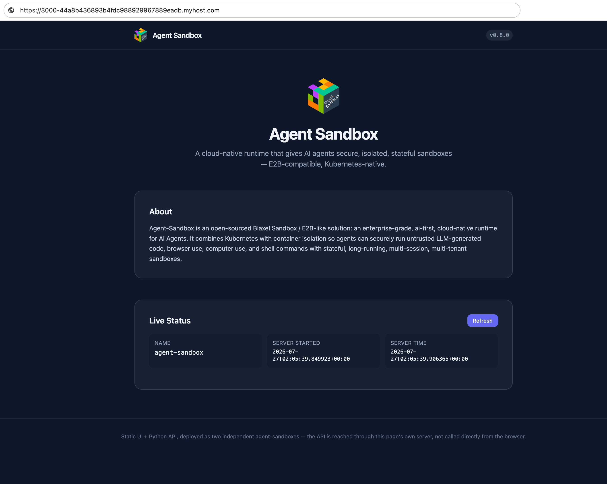

# Deploying AI-Generated Apps with an AI Agent

An AI agent can generate any app, e.g. website or backend service. The
**`ai-deploy`** skill ([`skills/ai-deploy/SKILL.md`](https://github.com/agent-sandbox/agent-sandbox/blob/main/skills/ai-deploy/SKILL.md)) lets the agent deploy
that app very easily — it turns the generated code into a live, public URL
on Agent-Sandbox, all by itself.

This guide shows the full flow, step by step. The examples use
[Claude Code](https://claude.com/product/claude-code) as the agent, but
the skill itself works with any agent that can read a `SKILL.md` and call
the E2B SDK.

## What the skill does

Deploying an app takes many steps, e.g. build it, create a sandbox, upload
the code, install dependencies, start the service. The skill gives the
agent one pipeline for all these steps. The agent skips any step a
project doesn't need:

```
1. generate project  →  2. build  →  3. push to git
  →  4. create/reuse sandbox  →  5. get the code onto it
  →  6. install deps  →  7. start  →  8. snapshot
  →  9. save deploy state  →  10. push to git
```

Two things make this work well for an agent:

- **It can run again and again.** Each deploy saves a small state file
  next to the project. Next time, the agent reads this file and
  reconnects to the *same* sandbox — same public URL. So "change the
  button color and redeploy" keeps the same link.
- **Idle sandboxes are free.** Each sandbox pauses by itself when idle,
  and resumes on the next request. No one needs to turn it on or off by
  hand.

If an app has more than one service, e.g. a UI and a backend, the agent
gives each one its own sandbox. If one service calls the other, the agent
uses Agent-Sandbox's internal address, not the public one. This keeps a
backend that only the UI should reach hidden from the internet.

## Example

Before the prompt, two things need to be in place:

**Env.** The agent needs E2B credentials to create sandboxes. These go in
a `.env` file next to the project:

```bash
E2B_API_KEY=<key>
E2B_DOMAIN=<domain>
E2B_API_URL=http://agent-sandbox.<domain>/e2b/v1
```

**Skill.** Claude Code loads skills from a `skills/` folder in the repo
(or `~/.claude/skills`). Once `skills/ai-deploy/SKILL.md` is there, Claude
Code picks it up on its own.

With that in place, here is a simple prompt that shows the whole flow:
build a small site that introduces Agent-Sandbox itself, backed by a live
API.

**Prompt:**

> Build a small website that introduces Agent-Sandbox — what it is, what
> it's for. Add a static frontend and a small backend API that the page
> calls for live status (name, version, uptime). Then deploy it with the
> `ai-deploy` skill so I can open it in a browser.

## What the agent does

Given this prompt, Claude Code writes a backend service and a
static frontend. 

Then it follows the skill to deploy them:

1. **Write the project.** Backend and frontend go in separate folders.
   Each gets its own sandbox:

    ```
    sample-app/
    ├── .ai-deploy-state.json   # saved sandbox IDs, one entry per service
    ├── api/
    │   └── server.py           # backend, listens on :8000
    └── ui/
        ├── server.js           # frontend, listens on :3000
        ├── index.html
        └── config.json         # backend's internal address, filled in by the agent
    ```

2. **Create one sandbox per service**, using the right base image for
   each service's runtime.
3. **Upload each service's files** into its sandbox.
4. **Connect the two.** Before starting the frontend, the agent gives it
   the backend's *internal* address. The browser only talks to the
   frontend, never to the backend:

    ``` mermaid
    flowchart TD
      Browser[Browser]
      subgraph Sandboxes
        direction LR
        Frontend[Frontend sandbox :3000]
        Backend[Backend sandbox :8000]
      end
      Browser -->|Frontend public URL| Frontend
      Frontend -->|internal address| Backend
    ```

5. **Start both services**, and check each one answers requests before
   calling the deploy done.
6. **Save the deploy state** — both sandbox IDs — so the next deploy can
   reuse them instead of starting from scratch.
7. **Return a public URL.**

Opening that URL shows the generated site, live:



The description, "server started" time, and "server time" all come from the backend, on every page load and every
click of **Refresh**. The frontend sandbox forwards this request
internally. The backend can't be reached from outside the cluster.

If a sandbox was paused from being idle, opening the URL wakes it back up
automatically. Neither the agent nor the user needs to do anything extra.

## See also

- [`skills/ai-deploy/SKILL.md`](https://github.com/agent-sandbox/agent-sandbox/blob/main/skills/ai-deploy/SKILL.md) — the full skill the agent follows
- [E2B SDK Workarounds](e2b_workarounds.md) — for environments without HTTPS/wildcard-domain support
