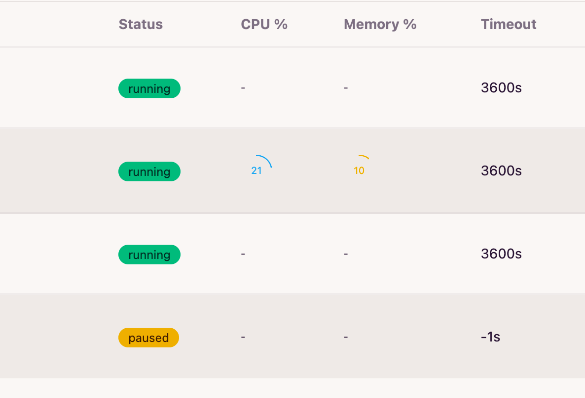
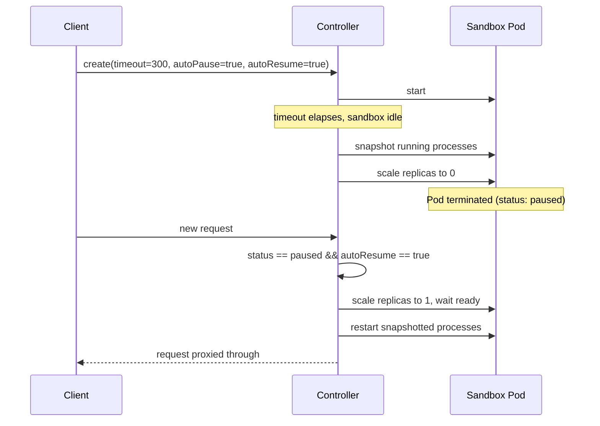

# Pause & Resume

A sandbox normally costs compute for as long as it's running. **Pause** stops
consuming CPU and memory and **Resume** brings it back.



## How it works

Pausing a sandbox:

1. Captures the list of processes currently running inside it (via `envd`)
   and stores that snapshot as an annotation on the sandbox's `ReplicaSet`.
2. Scales the `ReplicaSet` to `0` replicas — the Pod is terminated, so
   compute usage drops to zero.

Resuming a sandbox:

1. Scales the `ReplicaSet` back to `1` replica and waits for the new Pod to
   become ready.
2. Replays the captured snapshot, restarting each process with the same
   command and arguments it was launched with.

!!! note "What survives, what doesn't"
    A fresh Pod is created on resume, so the container's local disk is
    **not** preserved — only the process list is restarted. If
    your workload needs data to survive a pause, mount a network volume as
    described in [Shared Network Storage](network_storage.md).

## Two ways to trigger it

### Manual, via the REST API

Pause and resume any sandbox on demand:

```bash
curl -X POST http://<host>/api/v1/sandbox/pause/sandbox-01 \
  -H "Authorization: Bearer <api-key>"

curl -X POST http://<host>/api/v1/sandbox/resume/sandbox-01 \
  -H "Authorization: Bearer <api-key>"
```

Manual pause/resume works regardless of any feature flag — it's always
available.

### Automatic, on timeout and first access

Set these fields at sandbox creation time:

| Field | Description |
|-------|-------------|
| `timeout` | Max lifetime in seconds before the sandbox is considered expired. |
| `autoPause` | When `true`, an expired sandbox is **paused** instead of deleted. |
| `autoResume` | When `true`, a paused sandbox automatically resumes the moment it receives a new request (SDK `connect`, or any proxied request to it). |



Automatic pause-on-timeout also requires the `PAUSE_RESUME` feature flag to
be enabled (see [Environment Variables](../env.md)) for the calling user —
otherwise an expired sandbox is deleted instead of paused, even if
`autoPause` is set. Auto-resume-on-access has no such requirement; it only
depends on `autoResume`.

## Example

Using the E2B-compatible SDK, create a sandbox that pauses on timeout and
resumes automatically on the next access, then start a background server
inside it:

```python
from e2b import Sandbox

sbx = Sandbox.create(
    template="sandbox-base",
    timeout=5 * 60,  # pause after 5 minutes of no activity
    lifecycle={"on_timeout": "pause", "auto_resume": True},
)

# a long-running background process — its command line gets captured on pause
sbx.commands.run(
    "PYTHONPATH=/workspace/pylibs PATH=/workspace/npm/bin:$PATH python3 server.py > service.log 2>&1",
    background=True,
    timeout=0,
    cwd="/workspace",
)

print(sbx.sandbox_id, "is running")
```

If nothing talks to the sandbox for 5 minutes or `call pause api`, the controller pauses it and scales the Pod down to zero.

You can see exactly what was captured through `get_info()` — the snapshot
comes back as a base64 string under `info.metadata["snapshot"]`:

```python
import base64, json

info = sbx.get_info()
print(info.metadata["snapshot"])
# eyJjYXB0dXJlZF90aW1lIjoiMjAyNi0wOS0wM1QwMzoyNToyMS4yMDEzNTQ1NjlaIiwicHJvY2Vzc2VzIjpbeyJjb25m
# aWciOnsiY21kIjoiL2Jpbi9iYXNoIiwiYXJncyI6WyItbCIsIi1jIiwiUFlUSE9OUEFUSD0vd29ya3NwYWNlL3B5bGli
# cyBQQVRIPS93b3Jrc3BhY2UvbnBtL2JpbjokUEFUSCBweXRob24zIHNlcnZlci5weSBcdTAwM2Ugc2VydmljZS5sb2cg
# Mlx1MDAzZVx1MDAyNjEiXSwiY3dkIjoiL3dvcmtzcGFjZSJ9LCJwaWQiOjIwfV19

snapshot = json.loads(base64.b64decode(info.metadata["snapshot"]))
print(json.dumps(snapshot, indent=2))
```

```json
{
  "captured_time": "2026-09-03T03:25:21.201354569Z",
  "processes": [
    {
      "config": {
        "cmd": "/bin/bash",
        "args": [
          "-l",
          "-c",
          "PYTHONPATH=/workspace/pylibs PATH=/workspace/npm/bin:$PATH python3 server.py > service.log 2>&1"
        ],
        "cwd": "/workspace"
      },
      "pid": 20
    }
  ]
}
```

`sbx.commands.run(..., background=True)` is what wraps your command as
`/bin/bash -l -c "<your command>"` — that's why `cmd`/`args` show the shell
wrapper rather than `python3` directly.

The next call that touches this sandbox — another SDK call, or a request
routed to it through its port — triggers an automatic resume: a new Pod
comes up, and the controller re-runs that exact `cmd`/`args` in it.

```python
# ... later, possibly from a different process ...
sbx = Sandbox.connect(sbx.sandbox_id)  # transparently resumes if paused
result = sbx.commands.run("tail service.log", cwd="/workspace")
```

`python3 server.py` is running again with a brand-new PID — the snapshot
only restarts the process, it doesn't restore its old PID or any in-memory
state, so `service.log` only has whatever the new process has written so
far. `info.metadata["snapshot"]` keeps showing this same JSON — reflecting
the *last* pause — until the sandbox pauses again.

To manage the same sandbox by hand instead, use the native REST API:

```bash
curl -X POST http://<host>/api/v1/sandbox/pause/<name> \
  -H "Authorization: Bearer <api-key>"

curl -X POST http://<host>/api/v1/sandbox/resume/<name> \
  -H "Authorization: Bearer <api-key>"
```

## See also

- [Shared Network Storage](network_storage.md) — how to make data survive a
  pause/resume cycle
- [API Reference](../api.md) — full REST and E2B-compatible API surface
- [Environment Variables](../env.md) — feature flags, including
  `PAUSE_RESUME`
